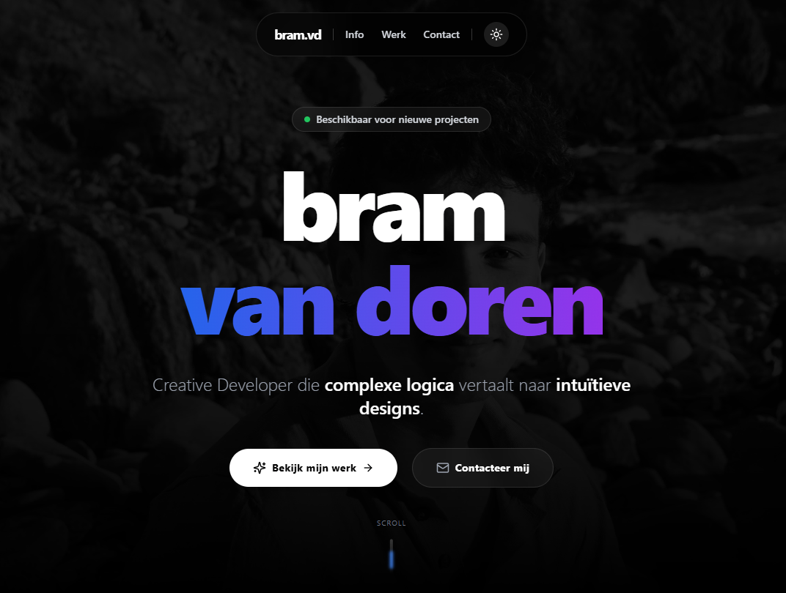

# 👨‍💻 Bram Van Doren - Creative Developer Portfolio

<!-- TIP: Maak een screenshot van je site, noem het 'banner.jpg' en zet het in je public map, of verwijder deze regel -->

> Een interactief portfolio dat de brug slaat tussen complexe backend logica en intuïtief frontend design.

## 🚀 Over het project

Dit is mijn persoonlijke portfolio website, gebouwd als een **Single Page Application (SPA)**. Het doel van dit project is om mijn vaardigheden als Creative Developer te tonen, niet alleen door middel van de getoonde projecten, maar ook door de code van de website zelf.

De site combineert strakke UI-elementen en soepele animaties, geoptimaliseerd voor prestaties en toegankelijkheid.

### ✨ Belangrijkste Features
*   **Animaties:** Complexe pagina-overgangen en scroll-animaties via Framer Motion.
*   **Responsive Design:** Volledig responsive layout dankzij Tailwind CSS.
*   **Dark Mode:** Ingebouwde thema-wisselaar (Licht/Donker).

## 🛠️ Gebruikte Technologieën

*   **Core:** React 18
*   **Build Tool:** Vite
*   **Styling:** Tailwind CSS
*   **Animaties:** Framer Motion
*   **Icons:** Lucide React
  
📬 Contact
Bram Van Doren - Creative Developer
🌐 Website: bramvandoren.com
💼 LinkedIn: www.linkedin.com/in/bram-van-doren-077802223/
🐙 GitHub: @bramvandoren
Gemaakt met ❤️ en veel ☕.